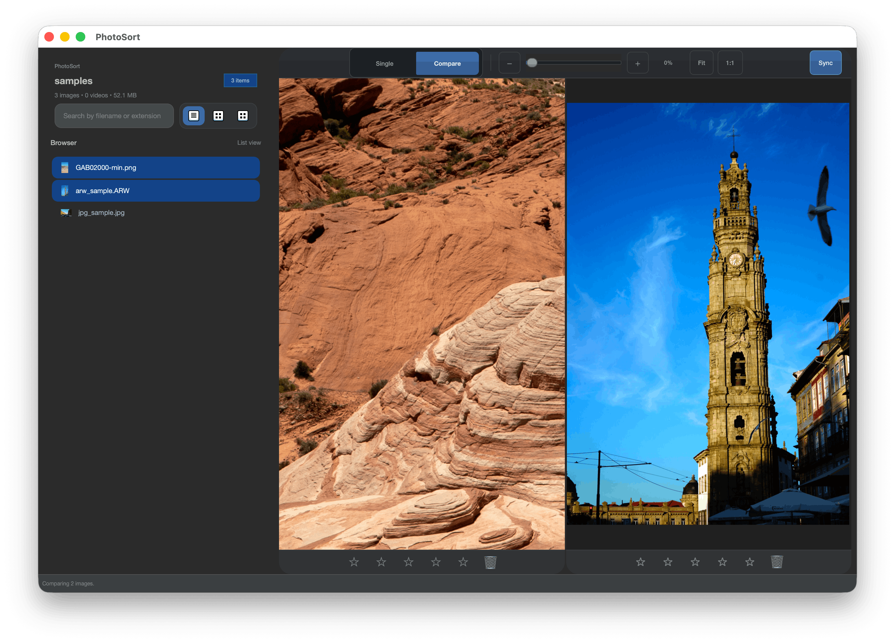
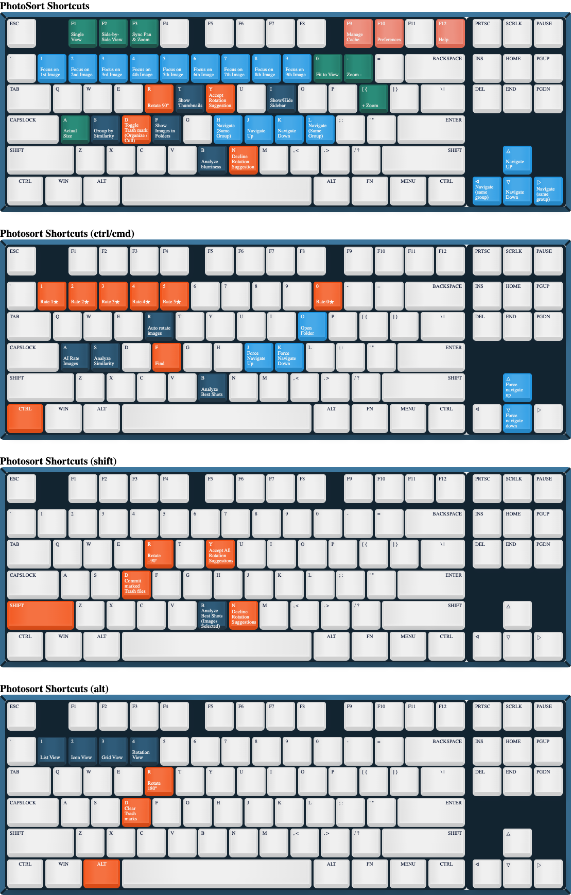

# PhotoSort: Photo Library Culler

<div align="center">
  
</div>

PhotoSort is a powerful and fast desktop application focused on speed designed to streamline the management of large photo libraries, making it easier than ever to sort, cull, and organize your libraries.

**Use this at your personal risk. Always use backups.**

## Key Features

* **Intelligent Culling Tools**:
  * **Ratings & Labels**: Assign star ratings for quick categorization.
  * **Blur Detection**: Automatically identify and flag blurry photos.
  * **AI Orientation Detection**: Auto-detects the correct image orientation using a lightweight ONNX model and proposes rotations.
  * **Similarity Analysis**: Group visually similar images to easily spot duplicates or near-duplicates.
  * **Fast Processing**: Intensive operations (scanning, thumbnailing, analysis) run once in batch to ensure fast image scrolling.
  * **Optimized Image Handling**: Supports a wide range of formats, including various RAW types, with efficient caching.
  * **Video Browsing Support**: Scan and browse common video formats with playback and first-frame thumbnails (analysis and ratings remain image-only).
  * **Intelligent Image Rotation**: Smart rotation system that automatically tries lossless metadata rotation first, with optional fallback to pixel rotation when needed.
  * **AI Best-Shot Ranking**: Send stacks to an OpenAI-compatible vision model (e.g. Qwen3-VL) to pick the keeper frame automatically.
  * **AI Star Ratings**: Ask the configured AI engine to score individual photos with 1–5 stars.
- **Performance Modes**: Configurable threading system (Settings → Preferences, `F10`) to balance between system responsiveness (Balanced) and maximum processing speed (Performance).
- **Metadata Display**: Shows EXIF information (camera model, exposure settings, etc.).

## Getting Started

### Installation & Running

You can download and install the program on the Releases page: https://github.com/duartebarbosadev/photosort/releases

If you prefer to build from source or want to contribute:

1. **Clone the repository:**

   ```bash
   git clone https://github.com/duartebarbosadev/photosort
   cd PhotoSort
   ```

2. **Install system dependencies (macOS only):**

   On macOS, the `pyexiv2` library requires certain system libraries to be installed via Homebrew:

   ```bash
   brew install brotli inih gettext
   ```

   > **Note**: These dependencies are only required on macOS. Windows and Linux users can skip this step.

> **Python version:** PhotoSort is tested on Python 3.12. Newer interpreters may work, but 3.12 is the supported target for now.

3. **Create a Python 3.12 virtual environment (recommended):**

   ```bash
   python3.12 -m venv venv
   source venv/bin/activate  # On Windows: venv\Scripts\activate
   ```

4. **Install dependencies:**
   Choose the appropriate requirements file based on your hardware:

   #### For CPU (Default)
   ```bash
   pip install -r requirements.txt
   ```

   #### For NVIDIA CUDA GPU Acceleration
   ```bash
   pip install -r requirements-cuda.txt
   ```

   > **Note**: The CUDA version requires NVIDIA CUDA Toolkit and cuDNN to be installed on your system.
   
   > **Note**: These packages are mutually exclusive. If switching between CPU and CUDA versions, create separate virtual environments or uninstall the current onnx package before installing the other.

5. **Run the application:**
   The main entry point is [`src/main.py`](src/main.py).

  ```
  python -m src.main [--folder FOLDER_PATH | --last-folder] [--clear-cache]

  # Examples:
  #   Open a specific folder at startup:
  #       python -m src.main --folder "C:/Users/MyUser/Pictures"
  #   Open the most recent folder at startup:
  #       python -m src.main --last-folder
  #   Clear all caches before starting:
  #       python -m src.main --clear-cache
  #   Open folder and clear caches (useful for development):
  #       python -m src.main --folder "C:/Users/MyUser/Pictures" --clear-cache
  ```

### AI Model Setup (Required for Rotation Detection)

To use the **Auto Rotate Images** feature (`Ctrl+R`), you need to download the pre-trained orientation detection model.

1. **Create a `models` directory** in the root of the project.
2. **Download the model file**:
   * **Link**: [Download orientation_model_v2_0.9882.onnx from Hugging Face](https://huggingface.co/DuarteBarbosa/deep-image-orientation-detection/tree/main)
3. **Place the downloaded model file inside the `models` directory.**

The application will automatically detect and load the model when you use the rotation detection feature.

### AI Best Shot Ranking & Ratings

PhotoSort relies on an OpenAI-compatible vision model to rank
similar shots and request AI star ratings. Configure the endpoint under
**Preferences → AI Rating Engine** (`F10`) by providing the API key (optional for
local deployments), base URL, model name, prompt templates, max tokens, timeout,
and concurrency. Any server that implements the OpenAI Chat Completions API with
vision support (for example, Qwen3-VL running in LM Studio) will work.

**Using the results**  
- **Similarity stacks**: After running **View → Analyze Similarity**, launch
  **View → Analyze Best Shots** (`Ctrl+B`) to automatically pick a winner for every cluster
  (metrics appear in the UI tooltips). For ad-hoc comparisons select a handful of
  images and trigger **View → Analyze Best Shots (Selected)** (`Alt+B`) to rank
  just that group.
- **AI star ratings**: To score every visible image, run **View → AI Rate Images**
  (`Ctrl+A`). The ratings are stored in your XMP sidecars/metadata cache so
  they survive reloads, and you can filter the library using the standard rating
  controls.

### Exporting Logs

To capture detailed logs for debugging, you can enable file logging by setting an environment variable before running the application.

* **macOS/Linux**:
  ```bash
  export PHOTOSORT_ENABLE_FILE_LOGGING=true
  python -m src.main
  ```
* **Windows (Command Prompt)**:
  ```bash
  set PHOTOSORT_ENABLE_FILE_LOGGING=true
  python -m src.main
  ```
* **Windows (PowerShell)**:
  ```powershell
  $env:PHOTOSORT_ENABLE_FILE_LOGGING="true"
  python -m src.main
  ```

Logs will be saved to `~/.photosort_logs/photosort_app.log`.

## **Keyboard Shortcuts**:



> **Note:** For the "Focus on image (1-9)" actions, if multiple images are highlighted, pressing `1` will show the first highlighted image, `2` the second, and so on.


## Contributing

Contributions are welcome! Please feel free to submit a pull request or open an issue for bugs, feature requests, or suggestions.
