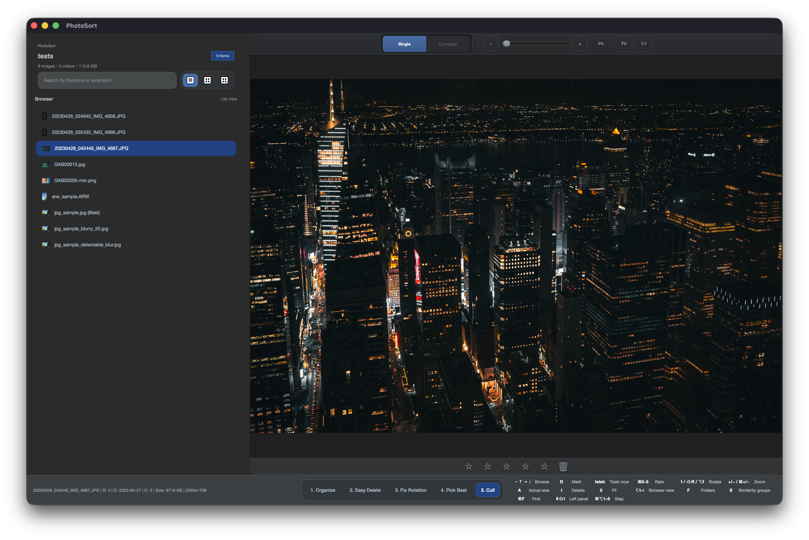
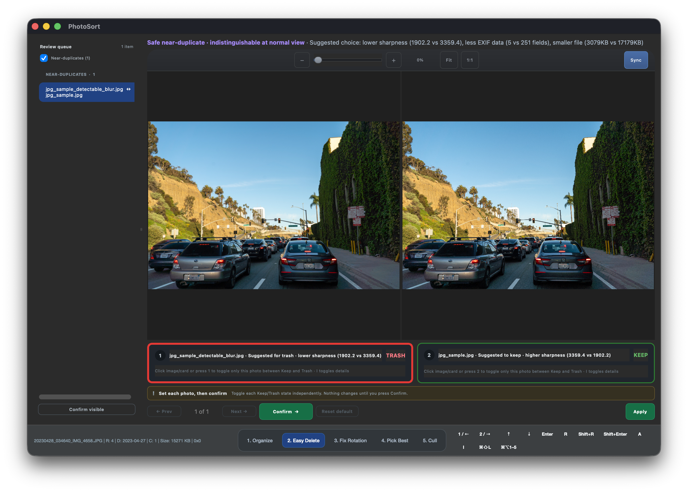
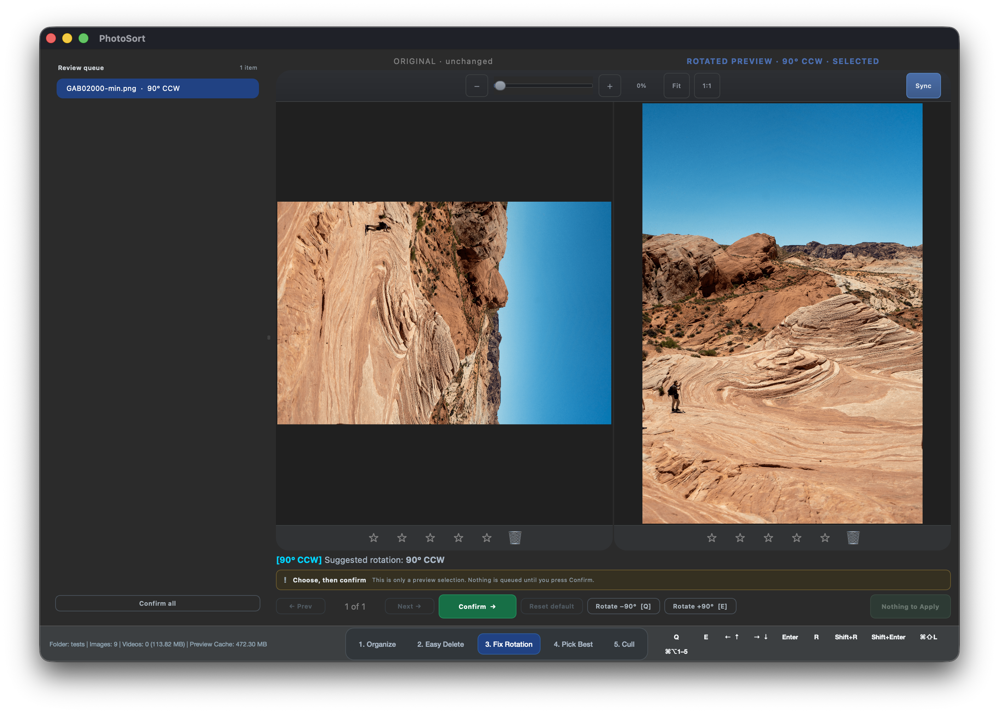
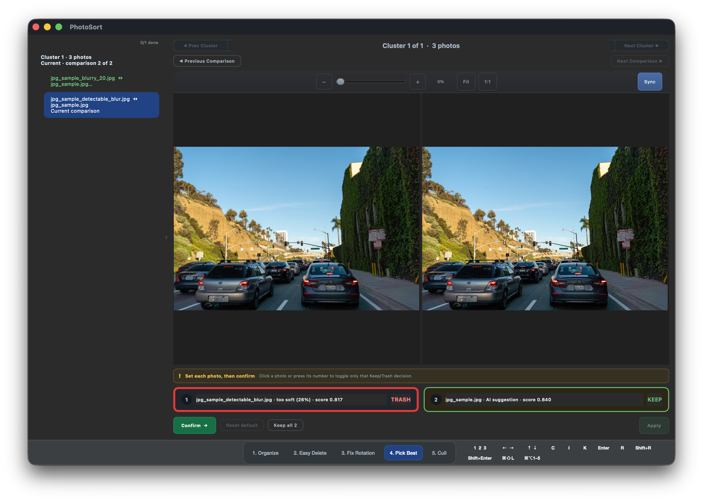

# PhotoSort

**Choose the photos worth keeping, before you start editing.**

PhotoSort is a desktop photo culling and organizing app. Browse a shoot, compare
similar frames side by side, rate your favorites, and remove the rejects. It
builds and reuses previews—including for RAW files—so revisiting a photo does
not mean decoding the original again every time.



[Download PhotoSort](https://github.com/duartebarbosadev/PhotoSort/releases) ·
[Your first cull](#your-first-cull) · [Workflows](#choose-your-workflow) ·
[What changes on disk?](#what-changes-on-disk)

## Is it for me?

PhotoSort is a good fit if you want to:

- Work through a large folder with keyboard controls and reusable previews.
- Compare bursts and similar shots, then keep the frames you prefer.
- Review suggestions for duplicates, blur, exposure problems, or incorrect rotation.
- Arrange photos into folders and add star ratings before using an editor.

It is a review tool, not a full photo editor or a replacement for a library
catalog. It supports common image formats and many camera RAW formats, plus
browsing and playback of common video formats. Ratings and image analysis are
for photos, not videos.

**No subscription, API key, or local LLM server is required.** Optional analysis
uses local models; some need an initial download. You can start with manual
browsing, comparison, ratings, and culling without those models.

## Download and open

Get a build from the official [GitHub Releases page](https://github.com/duartebarbosadev/PhotoSort/releases).
Prebuilt downloads do not require Python or a development environment.

| Your computer | Download | Open it |
| --- | --- | --- |
| Windows, including computers without an NVIDIA GPU | `PhotoSort-Windows-x64.zip` | Extract the ZIP, then run `PhotoSort.exe` inside the extracted folder. |
| Windows with a compatible NVIDIA GPU, for optional acceleration | `PhotoSort-Windows-x64-CUDA.zip` | Extract the ZIP, then run `PhotoSort.exe`. |
| Apple Silicon Mac | `PhotoSort-macOS-AppleSilicon.dmg` | Open the DMG and drag PhotoSort to Applications. |

**Unsure which Windows build to choose? Use the regular build.** CUDA is an
optional way to accelerate supported analysis on compatible NVIDIA hardware;
it does not unlock extra workflows. Check the release notes for requirements
and any differences in asset names. Linux users can [run from source](#running-from-source).

Release builds are currently unsigned. Download them from this repository's
release page and review any operating-system warning before opening them.
Where a release includes a `.sha256` file, you can use it to check that your
download matches the published artifact. This is an integrity check, not a
malware scan. If you want a VirusTotal check, scan the exact file you downloaded;
PhotoSort does not claim that every release has been scanned or certified safe.

## Your first cull

Start with a copy of a small photo folder while you learn the controls. Keep
backups of your originals.

1. Open PhotoSort and choose your folder with **File → Open Folder**.
2. Select **Cull** in the workflow bar at the bottom. You can go straight here;
   the earlier steps are optional.
3. Use **Up/Down** to browse. Press **D** to mark a reject; press it again to
   remove the mark. Marking alone does not delete the file.
4. Give favorites **5 stars** using the stars below the photo, or **Ctrl+5**
   (**⌘5** on macOS). Use the rating filter to review your favorites together.
5. When ready, press **Shift+Enter** to review pending work. Check the listed
   files and confirm before sending rejects to the system Trash or Recycle Bin.

To reconsider before applying, use **Alt+D** (**⌥D** on macOS) to clear deletion
marks. **Delete/Backspace is a separate “Trash now” action**: it asks for
confirmation and can remove the current selection without waiting for the
end of your cull.

### Compare a few similar shots

Select multiple photos in the browser to compare them side by side. Use
**Compare** above the viewer, then **Sync** to pan and zoom together while
checking focus or expressions. Return to **Single** to inspect one photo.

## Choose your workflow

The bottom bar lets you move between five steps. Use the ones that help with
your shoot; you do not have to complete all five. When leaving a step with
pending changes, PhotoSort asks how to handle them.

| Step | Use it to… | What you review |
| --- | --- | --- |
| **Organize** | Plan folders and move photos into them. | The current **Before** tree and proposed **After** tree, with a photo preview. |
| **Easy Delete** | Find obvious rejects sooner. | Suggestions for duplicates, blur, very dark photos, and very bright photos; choose Keep or Trash and confirm your decisions. |
| **Fix Rotation** | Correct a batch of sideways or upside-down photos. | Proposed rotations, with manual overrides, before applying them. |
| **Pick Best** | Choose among similar shots. | Local quality suggestions and comparisons; keep one, several, or all of the frames. |
| **Cull** | Browse freely and finish your review. | Photos, ratings, comparisons, and deletion marks. |

Analysis suggestions are starting points. Review them yourself before applying
changes, especially for intentional blur, silhouettes, or unusual compositions.

### Favorites, keepers, and RAW+JPEG pairs

For a simple favorite/keep/delete system, use **5 stars for favorites**, leave
other keepers unmarked, and use **D for rejects**. A rating does not move a file.

To make an actual `Favorites` or `Keep` folder:

1. Open **Organize** and use **Current** to start from the existing structure.
2. In the **After** tree, right-click and choose **Create folder**. Name it
   `Favorites` or `Keep`.
3. Drag the photos into the destination in the After tree. Review the proposed
   structure and preview the photos before applying.
4. Apply the plan and confirm the filesystem changes.

This is a reviewed folder plan, not a dedicated one-key “move to Favorites”
command. When PhotoSort finds companion files, choose **Yes, move companions**
to include matching same-name RAW/JPEG files and XMP sidecars. Check that choice
and the proposed destinations before moving files; do not assume every action
in every workflow automatically includes a RAW+JPEG pair.


### Easy Delete: review suggested rejects

Inspect the flagged photo and its comparison before confirming Keep or Trash.
This example compares a softer photo with its sharper counterpart.



### Fix Rotation: check the proposed correction

Review the proposed orientation and adjust it before applying the correction.



### Pick Best: compare the candidates

Review the local ranking and choose the frames you want to keep. This example
compares sharpness and local scores within a group of three similar photos.



### A few useful shortcuts

These are the everyday **Cull** controls. Other steps have their own controls;
enable **Settings → Preferences → Show shortcuts in the footer** to see them.
On macOS, use **⌘** for Ctrl and **⌥** for Alt in this table.

| Action | Shortcut |
| --- | --- |
| Browse photos | Up / Down |
| Mark or unmark a reject | D |
| Clear deletion marks | Alt+D |
| Review and apply pending work | Shift+Enter |
| Trash the selection, after confirmation | Delete / Backspace |
| Set a star rating; 0 clears it | Ctrl+0–5 |
| Show photo details | I |
| Fit the photo / show actual size | 0 / A |
| Single / side-by-side view | F1 / F2 |
| Preferences | F10 |

Number keys **1–9** focus a photo in a comparison; they do not assign stars.

## What changes on disk?

**There is no universal Undo for every action.** Review pending work before
applying it, and keep backups for operations that change files.

| Action | Effect and recovery |
| --- | --- |
| Browse, compare, or analyze | Creates caches and suggestions; preview generation does not replace your originals. |
| Mark a reject or edit an unapplied folder plan | Stages a decision. You can change your mind before applying it. |
| Confirm deletion | Moves files to the operating system's Trash/Recycle Bin. Restore them there if needed; PhotoSort has no in-app undelete. |
| Apply an Organize plan | Moves/renames files and creates the planned folders. There is no automatic rollback of the whole operation. |
| Assign stars | Writes the rating to supported image metadata immediately, in the background. Set a different rating or 0 to change it; this does not wait for Apply. |
| Apply rotations or use manual rotation controls | Changes orientation metadata where possible; pixel rotation may be used when needed. Do not rely on an inverse rotation as a lossless undo. |

Ratings use XMP rating metadata where writing is supported. Other applications
that read that metadata can use them, but format support and metadata refresh
behavior vary. Try a few files with your preferred editor first.

## Local analysis and model downloads

The current version's analysis runs locally. Your photos do not need to be sent
to a vision API, and the older LLM rating/ranking setup is no longer part of the
app. Internet access is needed to obtain missing models.

| Feature | Setup |
| --- | --- |
| Similarity and same-subject grouping | PhotoSort asks before downloading the similarity model, then reuses it and cached results. |
| Pick Best | Uses local technical checks and an aesthetic model; the aesthetic model may download on first use. |
| Fix Rotation | Requires an `orientation_model*.onnx` file. If it is missing, follow the app's model prompt. |

For manual rotation-model setup, download an `orientation_model*.onnx` asset
from [deep-image-orientation-detection releases](https://github.com/duartebarbosadev/deep-image-orientation-detection/releases).
Open **Help → About → Models Folder** in PhotoSort and place the file there.
Versioned model filenames work without renaming. Download the models you need
before working offline.

Large folders need time for their first scan and analysis, plus disk space for
cached previews. **Settings → Preferences** includes cache and performance
options. Cached previews make subsequent browsing cheaper; they do not make
every first-time analysis instantaneous.

<details>
<summary>Models used</summary>

- Similarity: `facebook/dinov2-small` by default, with `facebook/dinov2-base`
  available in Preferences.
- Pick Best aesthetic scoring: `cafeai/cafe_aesthetic`.
- Pick Best technical checks: OpenCV and MediaPipe face/eye analysis.
- Rotation: the local ONNX classifier from
  [deep-image-orientation-detection](https://github.com/duartebarbosadev/deep-image-orientation-detection).

</details>

## Help and feedback

[Open an issue](https://github.com/duartebarbosadev/PhotoSort/issues) for a bug,
a workflow question, or a feature request. Include your PhotoSort version,
operating system, file formats, and steps to reproduce the problem. A small
sample you can share is especially helpful for format-specific problems.

The screenshots above were captured on macOS using the project’s test images.
An older release may look different.

## Running from source

This section is for developers and users who want the development version.
**Python 3.14.x is required**; the application checks this at startup.

```bash
git clone https://github.com/duartebarbosadev/PhotoSort.git
cd PhotoSort
python3.14 -m venv venv
```

Activate the environment:

```bash
# macOS / Linux
source venv/bin/activate

# Windows Command Prompt
venv\Scripts\activate.bat
```

On macOS, install the system libraries used by `pyexiv2`:

```bash
brew install brotli inih gettext
```

Install dependencies and start PhotoSort:

```bash
python -m pip install -r requirements.txt
python -m src.main
```

For an NVIDIA CUDA environment, use `requirements-cuda.txt` instead. Use
separate environments for the CPU and CUDA variants of ONNX Runtime.

Useful launch options:

```bash
python -m src.main --folder "/path/to/photos"
python -m src.main --last-folder
python -m src.main --clear-cache
```

`--clear-cache` removes cached data, which must then be regenerated.
`--clear-models` removes downloaded models, so using those features again
requires downloading them again.

### Debug logs

Set `PHOTOSORT_ENABLE_FILE_LOGGING=true` and `PHOTOSORT_LOG_LEVEL=DEBUG` before
launching. For example, on macOS/Linux:

```bash
PHOTOSORT_ENABLE_FILE_LOGGING=true PHOTOSORT_LOG_LEVEL=DEBUG python -m src.main
```

On Windows PowerShell:

```powershell
$env:PHOTOSORT_ENABLE_FILE_LOGGING="true"
$env:PHOTOSORT_LOG_LEVEL="DEBUG"
python -m src.main
```

Logs are saved as `photosort_app.log` in:

- macOS: `~/Library/Logs/PhotoSort/`
- Windows: `%LOCALAPPDATA%\PhotoSort\Logs\`
- Linux: `$XDG_STATE_HOME/PhotoSort/`, or `~/.local/state/PhotoSort/` by default.

Review logs for personal paths and metadata before sharing them.

## Contributing

Bug reports, usability feedback, and pull requests are welcome. See
[DEVELOPER_GUIDE.md](DEVELOPER_GUIDE.md) for architecture and
[AGENTS.md](AGENTS.md) for development and verification guidelines.

```bash
python -m pip install -r requirements-dev.txt
python -m pytest
```

PhotoSort is licensed under [Apache 2.0](LICENSE).
