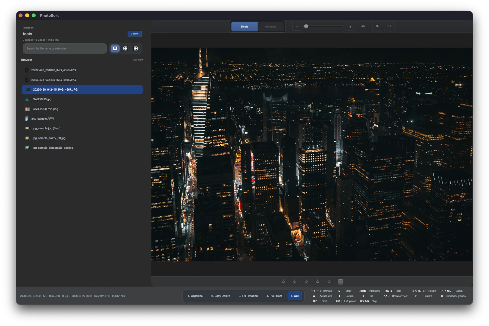
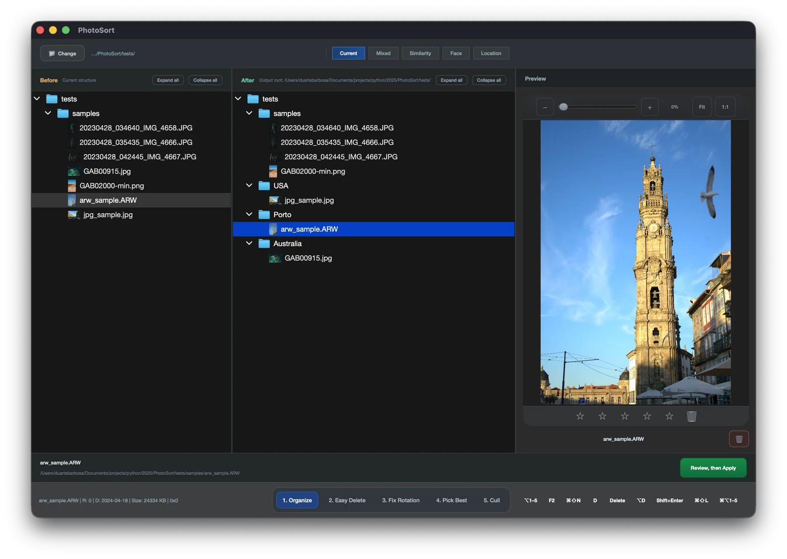
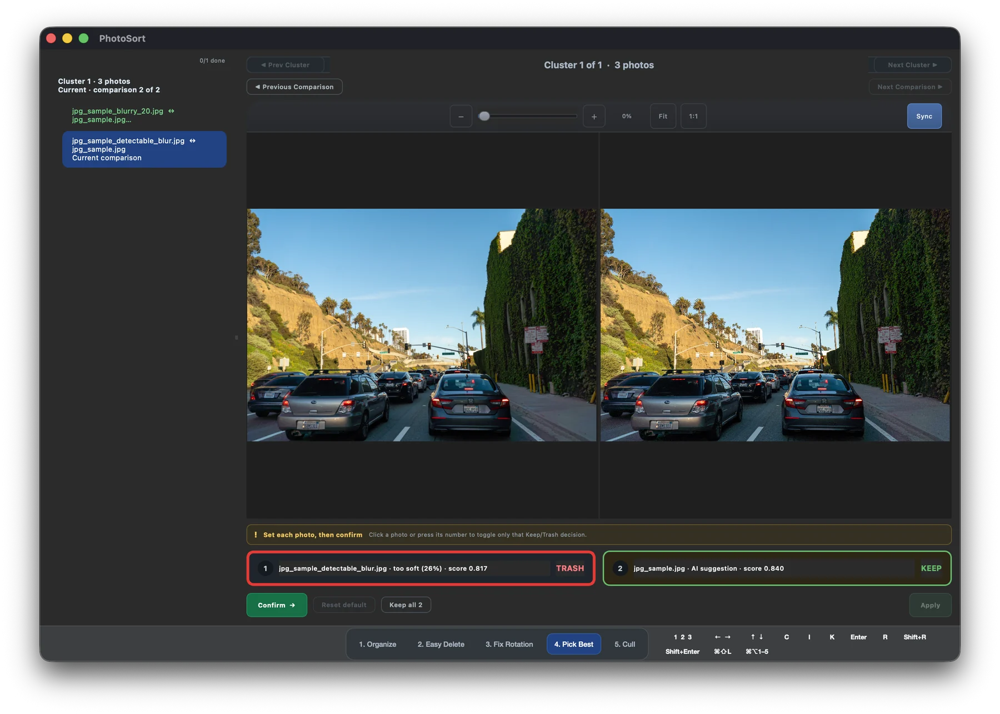

<h1 align="center">PhotoSort</h1>

<p align="center">
  <strong>Choose which photos to keep before you start editing.</strong>
</p>

<p align="center">
  <a href="https://www.python.org/downloads/"></a>
  <a href="https://www.riverbankcomputing.com/software/pyqt/"></a>
  <a href="https://github.com/duartebarbosadev/PhotoSort/releases"></a>
  <a href="https://github.com/duartebarbosadev/PhotoSort/actions/workflows/ci.yml"></a>
  <a href="LICENSE"></a>
</p>

PhotoSort helps you sort through a folder of photos and decide which ones to
keep. You can find blurry shots and duplicates, compare similar photos side by
side, and organize your favorites into folders. Mark the photos you don’t want
as you go, then review them before moving anything to Trash.

[](assets/main-window-screenshot.webp)

<p align="center">
  <a href="https://github.com/duartebarbosadev/PhotoSort/releases">Download</a> ·
  <a href="#supported-files">Supported files</a> ·
  <a href="#choose-your-workflow">Workflows</a> ·
  <a href="#useful-shortcuts">Shortcuts</a>
</p>

## Download

Download PhotoSort from the [Releases page](https://github.com/duartebarbosadev/PhotoSort/releases).

## Supported files

PhotoSort opens JPEG, PNG, TIFF, WebP, and many camera RAW formats. You can also
browse and play common video formats, but ratings and analysis only work with
photos.

## Choose your workflow

There are five steps along the bottom of the window. Use whichever ones you
need. You don't have to go through them all or follow a particular order.

| Step | What it's for |
| --- | --- |
| **Organize** | Arrange photos into folders. |
| **Easy Delete** | Find duplicates, blurry shots, and exposure problems. |
| **Fix Rotation** | Correct sideways or upside-down photos. |
| **Pick Best** | Choose favorites from similar shots. |
| **Cull** | Review photos manually and choose what to keep. |

### Organize

Arrange photos into folders and check the result before moving anything.
RAW+JPEG pairs and XMP sidecars can move together.

[](assets/organize-screenshot.webp)

### Easy Delete

PhotoSort flags duplicates, blurry shots, and photos that may be too dark or
bright. Compare them and decide which ones to keep.

[](assets/easy-delete-screenshot.webp)

### Fix Rotation

Check the suggested rotation next to the original. Adjust it if needed, then
apply the changes.

[](assets/fix-rotation-screenshot.webp)

### Pick Best

Compare similar photos with suggestions based on image quality and faces.
Choose your favorites, or keep them all.

[](assets/pick-best-screenshot.webp)

### Useful shortcuts

See the [complete keyboard guide](docs/keyboard-shortcuts.md) for separate maps
and shortcut tables for all five workflows.

These shortcuts are for **Cull**. Each step has its own controls. To show them,
turn on **Settings → Preferences → Show shortcuts in the footer**.
On macOS, use **⌘** instead of Ctrl and **⌥** instead of Alt.

| What you want to do | Shortcut |
| --- | --- |
| Browse photos | Up / Down |
| Mark or unmark a photo for deletion | D |
| Clear deletion marks | Alt+D |
| Review and apply your changes | Shift+Enter |
| Send selected photos to Trash, after confirming | Delete / Backspace |
| Give a star rating, or clear it with 0 | Ctrl+0 to Ctrl+5 |
| Show photo details | I |
| Fit the photo / show actual size | 0 / A |
| Show one photo / compare side by side | F1 / F2 |
| Open Preferences | F10 |

Pressing **1 to 9** focuses a specific photo in a comparison.

## What happens to my files?

**Some choices can be changed before you apply them, but there isn't an Undo
button for everything.**

| What you do | What happens |
| --- | --- |
| Browse, compare, or run analysis | PhotoSort makes previews and suggestions. It doesn't replace your originals. |
| Mark a photo for deletion | Nothing is deleted yet. Unmark it or clear the marks to change your mind. |
| Edit a folder layout in Organize | The changes wait for you to apply them. You can still change the plan. |
| Confirm deletion | Files go to the system Trash or Recycle Bin. Restore them there if needed. PhotoSort doesn't have its own restore button. |
| Apply changes in Organize | Files are moved or renamed and folders are created. There isn't a button to undo the whole operation. |
| Give a star rating | The rating is saved to the photo's metadata where supported, without waiting for Apply. Choose another rating or 0 to change it. |
| Apply a rotation or rotate manually | PhotoSort changes orientation metadata where possible. Some formats need the image pixels rotated instead, so rotating back may not fully restore the original. |

Keep backups, especially before moving files or applying rotations.

PhotoSort writes ratings to XMP metadata where supported. Editors that read
those ratings can use them too. Try a few photos with your editor first, since
support varies by format and the editor may need to reload the metadata.

## Do I need to set up AI?

PhotoSort downloads some models the first time you use an analysis feature.
Your photos stay on your computer. You can browse and sort photos without
setting up the analysis features.

| Feature | What you need |
| --- | --- |
| Group similar photos | PhotoSort asks to download a model the first time, then reuses it. |
| Pick Best | Uses local quality checks and a model that may need downloading the first time. |
| Fix Rotation | Needs an `orientation_model*.onnx` file. The app explains what to do if it's missing. |

To install the rotation model yourself, download an `orientation_model*.onnx`
file from [the model's releases page](https://github.com/duartebarbosadev/deep-image-orientation-detection/releases).
In PhotoSort, open **Help → About → Models Folder** and put the file there.
You don't need to rename it.

Download any models you need before working offline. The first scan or analysis
of a large folder can take a while. Previews also use disk space. You can adjust
cache and performance settings in **Settings → Preferences**.

<details>
<summary>Which models does PhotoSort use?</summary>

- Similarity: `facebook/dinov2-small` by default. You can choose
  `facebook/dinov2-base` in Preferences.
- Pick Best aesthetic scoring: `cafeai/cafe_aesthetic`.
- Pick Best face and eye checks: OpenCV and MediaPipe.
- Rotation: the ONNX model from
  [deep-image-orientation-detection](https://github.com/duartebarbosadev/deep-image-orientation-detection).

</details>

## Questions or feedback?

[Open an issue](https://github.com/duartebarbosadev/PhotoSort/issues) if something
isn't working, a step is confusing, or you'd like a feature. For bugs, include
your PhotoSort version, operating system, file formats, and what you did before
the problem happened. A small sample photo helps if you can share one.

## Running from source

You only need these instructions if you want to run the development version
or work on the code. You'll need **Python 3.14.x**.

```bash
git clone https://github.com/duartebarbosadev/PhotoSort.git
cd PhotoSort
python3.14 -m venv venv
```

Activate the environment:

```bash
# macOS / Linux
source venv/bin/activate

# Windows Command Prompt
venv\Scripts\activate.bat
```

On macOS, install the system libraries used by `pyexiv2`:

```bash
brew install brotli inih gettext
```

Install dependencies and start PhotoSort:

```bash
python -m pip install -r requirements.txt
python -m src.main
```

For an NVIDIA CUDA environment, use `requirements-cuda.txt` instead. Use
separate environments for the CPU and CUDA variants of ONNX Runtime.

Useful launch options:

```bash
python -m src.main --folder "/path/to/photos"
python -m src.main --last-folder
python -m src.main --clear-cache
```

`--clear-cache` deletes saved previews and other cached data. PhotoSort will
build them again when needed. `--clear-models` deletes downloaded models, so
you will need to download them again to use those features.

### Debug logs

Set `PHOTOSORT_ENABLE_FILE_LOGGING=true` and `PHOTOSORT_LOG_LEVEL=DEBUG` before
launching. For example, on macOS/Linux:

```bash
PHOTOSORT_ENABLE_FILE_LOGGING=true PHOTOSORT_LOG_LEVEL=DEBUG python -m src.main
```

On Windows PowerShell:

```powershell
$env:PHOTOSORT_ENABLE_FILE_LOGGING="true"
$env:PHOTOSORT_LOG_LEVEL="DEBUG"
python -m src.main
```

Logs are saved as `photosort_app.log` in:

- macOS: `~/Library/Logs/PhotoSort/`
- Windows: `%LOCALAPPDATA%\PhotoSort\Logs\`
- Linux: `$XDG_STATE_HOME/PhotoSort/`, or `~/.local/state/PhotoSort/` by default.

Review logs for personal paths and metadata before sharing them.

## Contributing

Bug reports, usability feedback, and pull requests are welcome. See
[DEVELOPER_GUIDE.md](DEVELOPER_GUIDE.md) for architecture and
[AGENTS.md](AGENTS.md) for development and verification guidelines.

```bash
python -m pip install -r requirements-dev.txt
python -m pytest
```

PhotoSort is licensed under [Apache 2.0](LICENSE).
