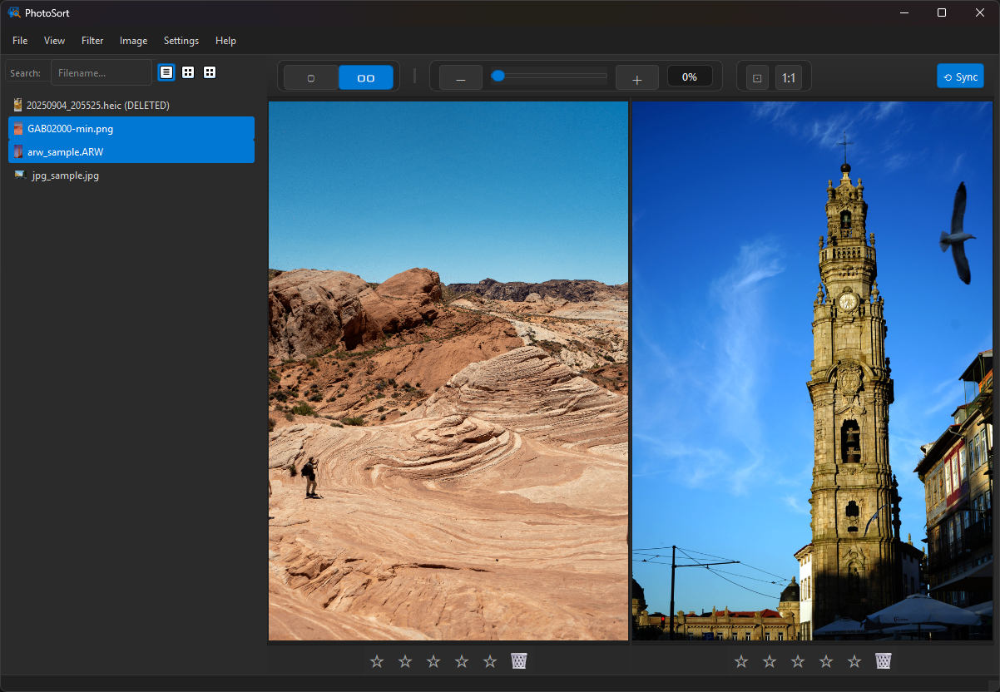

# PhotoSort: Photo Library Culler & Organizer

<div align="center">
  
</div>

PhotoSort is a powerful desktop application focused on speed designed to streamline the management of large photo libraries, making it easier than ever to sort, cull, and organize your images.

**Warning - Use this at your personal risk. Always use backups.**

## Key Features

* **Intelligent Culling Tools**:
  * **Ratings & Labels**: Assign star ratings for quick categorization.
  * **Blur Detection**: Automatically identify and flag blurry photos.
  * **AI Orientation Detection**: Auto-detects the correct image orientation using a lightweight ONNX model and proposes rotations.
  * **Similarity Analysis**: Group visually similar images to easily spot duplicates or near-duplicates.
  * **Fast Processing**: Intensive operations (scanning, thumbnailing, analysis) run once in batch to ensure fast image scrolling.
  * **Optimized Image Handling**: Supports a wide range of formats, including various RAW types, with efficient caching.
  * **Intelligent Image Rotation**: Smart rotation system that automatically tries lossless metadata rotation first, with optional fallback to pixel rotation when needed.

- **Update Notifications**: Automatically checks for new releases and notifies users when updates are available, with direct download links.
- **Metadata Display**: Shows EXIF information (camera model, exposure settings, etc.).

## Getting Started

### Hardware Acceleration (Optional, Recommended)

For significantly faster AI-powered features like **Rotation Detection** and **Similarity Analysis**, use the appropriate requirements file for your hardware.

#### For NVIDIA GPUs (CUDA)
Use [`requirements-cuda.txt`](requirements-cuda.txt) which includes `onnxruntime-gpu`. Requires NVIDIA CUDA Toolkit & cuDNN.

#### For CPU (Default)
Use [`requirements.txt`](requirements.txt) which includes the standard `onnxruntime` package.

> **Note**: These packages are mutually exclusive. If switching between CPU and CUDA versions, create separate virtual environments or uninstall the current onnx package before installing the other.

### AI Model Setup (Required for Rotation Detection)

To use the **Auto Rotate Images** feature (`Ctrl+R`), you need to download the pre-trained orientation detection model.

1. **Create a `models` directory** in the root of the project.
2. **Download the model file**:
   * **Link**: [Download orientation_model_v2_0.9882.onnx from Hugging Face](https://huggingface.co/DuarteBarbosa/deep-image-orientation-detection/tree/main)
3. **Place the downloaded model file inside the `models` directory.**

The application will automatically detect and load the model when you use the rotation detection feature.

### Installation & Running

1. **Clone the repository (if applicable):**

   ```bash
   git clone https://github.com/duartebarbosadev/photosort
   cd PhotoSort
   ```
2. **Create a virtual environment (recommended):**

   ```bash
   python -m venv venv
   source venv/bin/activate  # On Windows: venv\Scripts\activate
   ```
3. **Install dependencies:**
   Choose the appropriate requirements file based on your hardware:

   #### For CPU (Default)
   ```bash
   pip install -r requirements.txt
   ```

   #### For NVIDIA CUDA GPU Acceleration
   ```bash
   pip install -r requirements-cuda.txt
   ```

   > **Note**: The CUDA version requires NVIDIA CUDA Toolkit and cuDNN to be installed on your system.
4. **Run the application:**
   The main entry point is [`src/main.py`](src/main.py).

   ```bash
   python -m src.main [--folder FOLDER_PATH] [--clear-cache]

   # Examples:
   #   Open a specific folder at startup:
   #       python -m src.main --folder "C:/Users/MyUser/Pictures"
   #   Clear all caches before starting:
   #       python -m src.main --clear-cache
   #   Open folder and clear caches (useful for development):
   #       python -m src.main --folder "C:/Users/MyUser/Pictures" --clear-cache
   ```

### Exporting Logs

To capture detailed logs for debugging, you can enable file logging by setting an environment variable before running the application.

* **macOS/Linux**:
  ```bash
  export PHOTOSORT_ENABLE_FILE_LOGGING=true
  python -m src.main
  ```
* **Windows (Command Prompt)**:
  ```bash
  set PHOTOSORT_ENABLE_FILE_LOGGING=true
  python -m src.main
  ```
* **Windows (PowerShell)**:
  ```powershell
  $env:PHOTOSORT_ENABLE_FILE_LOGGING="true"
  python -m src.main
  ```

Logs will be saved to `~/.photosort_logs/photosort_app.log`.

## **Keyboard Shortcuts**:


> **Note:** For the "Focus on image (1-9)" actions, if multiple images are highlighted, pressing `1` will show the first highlighted image, `2` the second, and so on.

## Future Enhancements (Ideas)

* **Enhanced Search Capabilities**:
  * Search by EXIF metadata (camera model, settings, date ranges)
  * Search by color labels and custom tags
  * Saved search presets
* **Sort/Order by Rating**: Implement functionality to sort or reorder images directly based on their assigned star ratings.
* **AI-Driven Exposure Analysis**: Introduce a feature to detect and flag images with potentially good or problematic exposure (e.g., under/overexposed).
* **Automated Best Shot Selection in Clusters**:
  * Within similarity clusters, automatically suggest or select the "best" image(s).
  * Criteria could include: lowest blurriness score, optimal exposure, AI composition analysis, no one with eyes close etc.
* **Advanced AI Object/Scene Detections & Grouping**:
  * **Car Model Recognition**: Identify and allow grouping by specific car models in photos.
  * **Face Recognition/Clustering**: Detect faces and group photos by the people present.
* **Side by Side** Select Multiple images and see them side by side, with zoom lock etc.
* **Video Support**

## Contributing

Contributions are welcome! Please feel free to submit a pull request or open an issue for bugs, feature requests, or suggestions.
