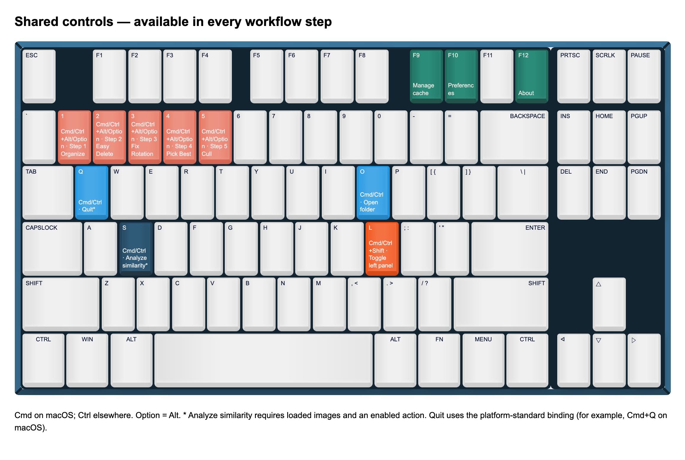
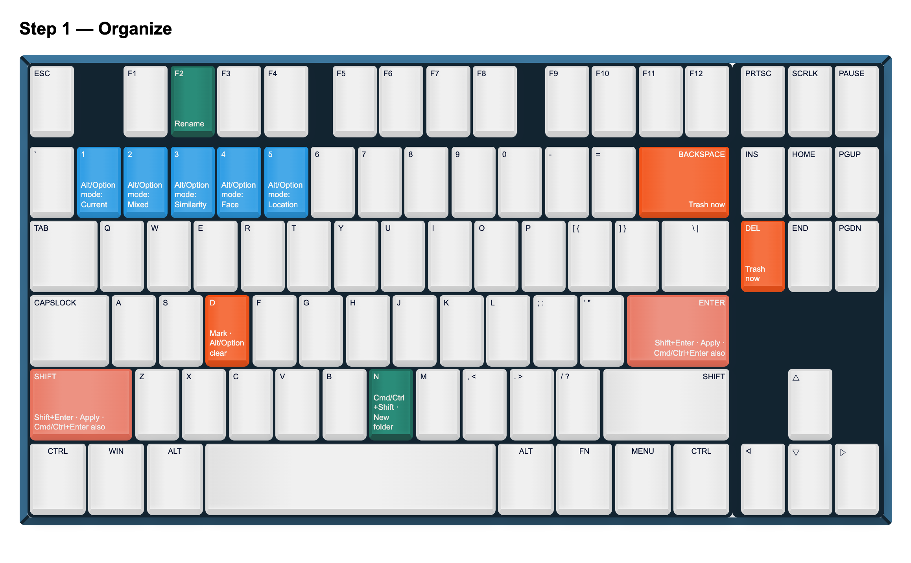
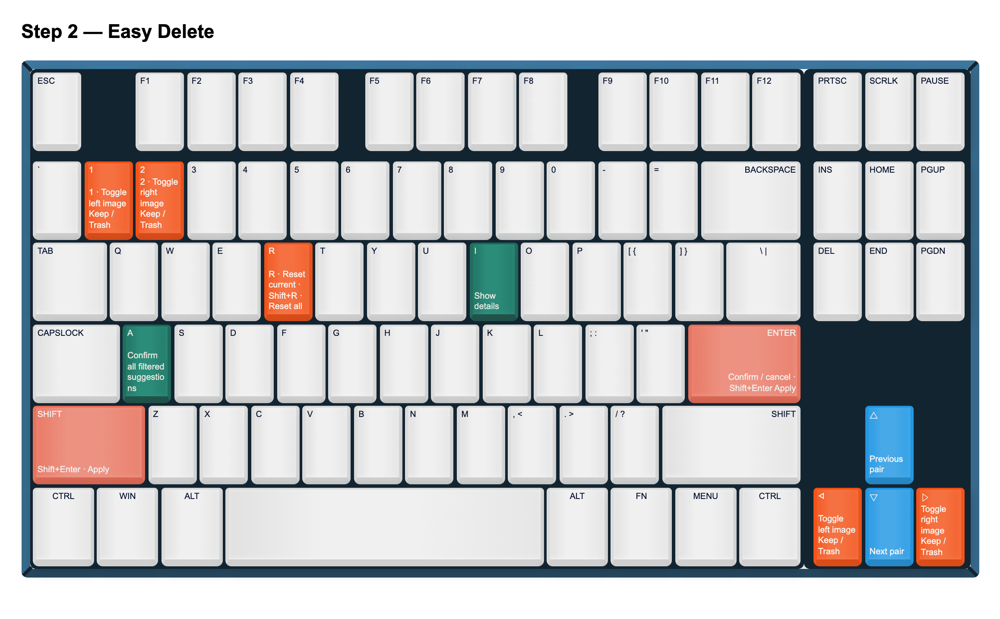
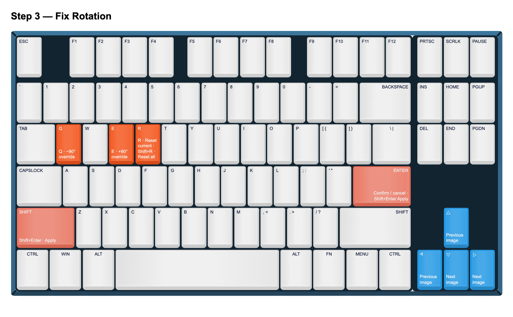
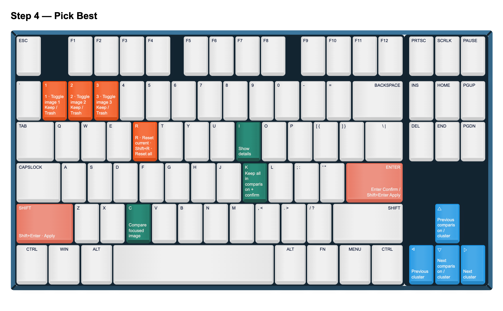
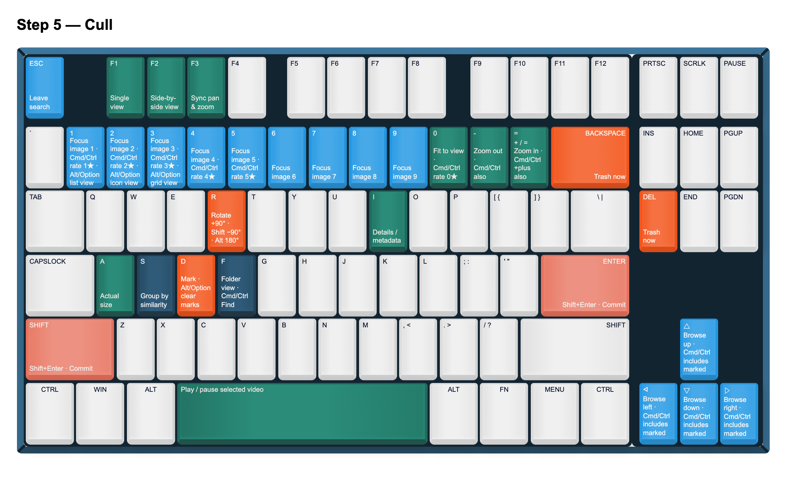

# Keyboard shortcuts

Each workflow has its own keyboard controls. Enable **Settings → Preferences →
Show shortcuts in the footer** to see the controls for the current step.

Use **Cmd (⌘)** for `Ctrl` and **Option (⌥)** for `Alt` on macOS. `Enter` also
means the numeric keypad Enter key. Shortcuts depend on the active workflow,
selection and available results; text fields and dialogs can own keyboard input.

- [Shared controls](#shared-controls)
- [Organize](#organize)
- [Easy Delete](#easy-delete)
- [Fix Rotation](#fix-rotation)
- [Pick Best](#pick-best)
- [Cull](#cull)

## Shared controls



| Shortcut | Action |
| --- | --- |
| Ctrl+O | Open a folder |
| Ctrl+Shift+L | Show or hide the current workflow's left panel |
| Ctrl+Alt+1–5 | Go to Organize, Easy Delete, Fix Rotation, Pick Best or Cull, respectively; the destination must be available |
| Ctrl+S | Analyze similarity, when the action is enabled for loaded images* |
| F9 | Manage cache |
| F10 | Preferences |
| F12 | About |
| Platform Quit shortcut | Exit PhotoSort* |

\* Analyze Similarity is not restricted to Cull, but is disabled while unavailable
or processing. Quit uses Qt's platform-standard binding (for example, Cmd+Q on
macOS); the `Q` key on the map is shorthand, not a universal Ctrl+Q guarantee.

## Organize



| Shortcut | Action |
| --- | --- |
| Alt+1 / Alt+2 / Alt+3 / Alt+4 / Alt+5 | Current / Mixed / Similarity / Face / Location mode |
| F2 | Rename the selected item |
| Ctrl+Shift+N | Create a folder |
| D | Mark or unmark the selected item for deletion |
| Alt+D | Clear deletion marks |
| Delete / Backspace | Request immediate trashing of the selection |
| Shift+Enter or Ctrl+Enter | Review and apply changes |

The folder tree also supports its usual arrow-key navigation and expansion.

## Easy Delete



| Shortcut | Action |
| --- | --- |
| 1 or Left | Toggle the left image between Keep and Trash |
| 2 or Right | Toggle the right image between Keep and Trash |
| Up / Down | Previous / next review pair |
| Enter | Confirm the current review and advance; on an already confirmed review, cancel its confirmation and restore prior marks |
| R | Reset the current review to its defaults |
| Shift+R | Reset all reviews to their defaults |
| A | Confirm default suggestions for all reviews in the current filtered list |
| I | Show or hide details |
| Shift+Enter | Review and apply deletion marks |

`A` covers the current filtered review list, not just the two photos on screen.
Confirming a review records its decisions; applying performs the file operation.

## Fix Rotation



| Shortcut | Action |
| --- | --- |
| Q / E | Rotate the preview −90° / +90° per press, overriding the suggestion |
| Left or Up | Previous image |
| Right or Down | Next image |
| Enter | Confirm the current image and advance; cancel confirmation if already confirmed |
| R | Reset the current image to its default rotation |
| Shift+R | Reset all images to their default rotations |
| Shift+Enter | Apply confirmed rotation changes |

## Pick Best



| Shortcut | Action |
| --- | --- |
| 1 / 2 / 3 | Toggle the corresponding image between Keep and Trash |
| Left / Right | Previous / next cluster |
| Up / Down | Previous / next comparison, crossing clusters when necessary |
| C | Toggle focused comparison mode |
| I | Show or hide details |
| K | Keep every image in the current comparison, confirm and advance |
| Enter | Confirm the current comparison and advance |
| R | Reset the current comparison to its defaults |
| Shift+R | Reset all comparisons to their defaults |
| Shift+Enter | Review and apply deletion marks |

## Cull



| Shortcut | Action |
| --- | --- |
| 1–9 | Focus an image in the current group or comparison |
| Left / Right | Browse within the group, or sequentially when not grouped |
| Up / Down | Browse sequentially |
| Ctrl+arrow keys | Browse including images marked for deletion; ordinary navigation skips them |
| D | Mark or unmark for deletion |
| Alt+D | Clear deletion marks |
| Delete / Backspace | Send the selection to Trash after confirmation |
| Shift+Enter | Review and commit deletion marks |
| Ctrl+0–5 | Set the star rating; 0 clears it |
| R / Shift+R / Alt+R | Rotate +90° / −90° / 180° |
| + or = / − | Zoom in / out with the image viewer focused |
| Ctrl++ / Ctrl+− | Zoom in / out using the menu shortcuts |
| 0 / A | Fit to view / actual size |
| Space | Play or pause the focused video |
| I | Show or hide image details / metadata |
| F1 / F2 | Single / side-by-side view |
| F3 | Toggle synchronized pan and zoom |
| Alt+1 / Alt+2 / Alt+3 | List / icon / grid browser view |
| F | Toggle folder view |
| S | Toggle grouping by similarity |
| Ctrl+F | Focus search (Cull only) |
| Escape | Leave the search field and return focus to the file view |

In the intro-video dialog, Escape, Space and Enter dismiss the dialog.

## Updating the maps

The editable source is [keyboard-layout.html](../assets/keyboard-layout.html).
It was exported from Keyboard Shortcut Map Maker; shortcut text is maintained
manually. The PNGs above are rendered from its six keyboard sections.

After editing the HTML, regenerate them with:

```sh
node scripts/export_keyboard_layout.cjs
```

The exporter requires the Node `playwright` package and its Chromium browser.
To use an existing Chrome/Chromium installation, set `CHROMIUM_EXECUTABLE_PATH`
to its executable.
Compare changes against `src/ui/workflow_review_components.py`,
`src/ui/menu_manager.py`, and the key handlers in `src/ui/main_window.py` and
`src/ui/advanced_image_viewer.py`. The HTML and this guide are documentation,
not the application's binding registry.
